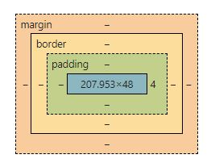

# CSS
2022/07/02

## Cascading Style Sheet

```css
/* 선택자 */
selector {
    property : value;
    /* 선언부 */
}
```
- link 로 css 연결  
- style 태그  
- 인라인으로 삽입(좋지 않은 방법)
---
## Selector 선택자


- ### Type Selector
>일반 태그에 꾸미기
- ### Class Selector
>.box  
여러개의 클래스를 갖을수있다.    
`<div class ="box-0 box-1 box-2">` <strong>띄어쓰기 필수</strong>  
`.box1.box2`-`box1이자 box2` 띄어쓰기가 없을 경우 하나로 취급 

- ### ID Selector  
>`<div id=box>`  
`#box`
  
- 자식 선택자  
`parent > child`
- 자손 선택자  
`parent공백descendants`  
- 형제 선택자s  
`?? ~ !!` : ?? 다음부터 !!까지  
`??+!!` : ?? 다음에 오는 !! 태그

- first child  
`li:first-child`

- last child  
`li:last-child`

- nth child  
`li:nth-child(3)`  
`li:nth-child(2n)` - 짝수 번째  
`li:nth-child(2n-1)` - 홀수 번째  
  
- :hover - 마우스가 올라갔을 때
- :active - 마우스를 눌렀을 때
- :focus

### CSS 우선순위
- 앞에 쓰인 css 보다 뒤에 쓰인 css 가 우선순위가 높다

>1순위 : `ID`  
2순위 : `Class` `Pseudo-class`  
3순위 : `Type`  
 inline style : 1,2,3 순위보다 높다.  
 !important : 어떠한 우선순위 보다 높다.

---
## BOX Model


- `content` : width x height
- `Padding` : `content`와 `border` 사이 공간
- `border` : 테두리  
- `margin` : 바깥 여백, 요소와 요소 사이 간격

- `속기형 Shorthand`(시계 방향)  
top - rigth - bottom - left


```css
*{
    box-siziing : content-box;
}
```
기본적으로 cotent box 사이즈로 설정 되어있기 때문에 border box 사이즈로 변경 해주어야 한다.

## Display
> block  
>-  따로 width를 선언하지 않은경우, `width = 부모의 content-box의 100%`
>-  따로 width를 선언한 경우, `남은공간은 margin으로 자동 채움`
>-  따로 부모의 height를 선언하지 않을 경우,  `자식 요소의 height의 합 = 부모의 height`

> inline
>- **사용불가**  
    `width` , `height` , `padding-top` , `padding-bottom` , `border-top` , `border-bottom` , `margin-top` , `margin-bottom` 

> inline-block

- float  
`display : block` 으로 변경
- `overflow : hidden` float 한 자식 요소를 찾는다.
- `Clearfix` : left | right | both

>가상요소 ::before / ::after  
content : " ";